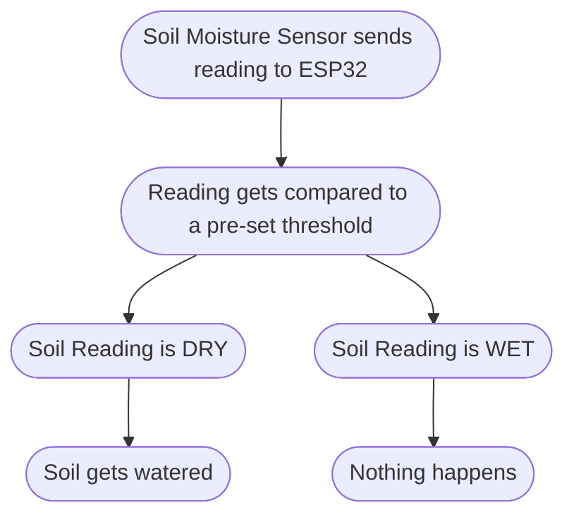
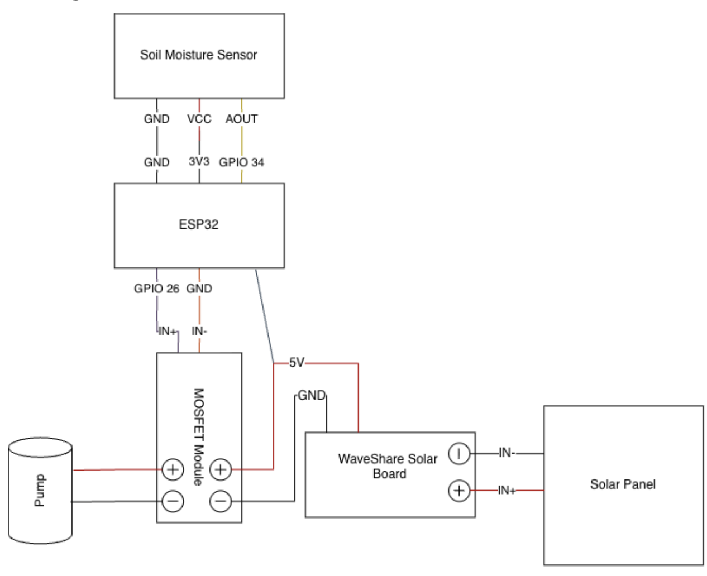

<h1 align="center">Solar-Powered Smart Irrigation System</h1>

  <b>Built by Pranavi Bhagavathula & Arhanth Kanda</b>

  Solar-powered plant watering system that utilizes soil moisture readings to determine when to autonomously water your garden, while also    being able to monitor and control it from your phone.

---

<h3>Table of Contents</h3>

1. [Why We Built This](#why-we-built-this)
2. [How it Works](#how-it-works)
3. [Features](#features) 
4. [Parts List](#parts-list)
5. [Wiring](#wiring)
6. [Software Setup](#software-setup)
7. [Building](#building)
8. [Calibration](#calibration)
9. [Challenges](#challenges)
10. [Results](#results)
11. [Community Impact](#community-impact)
12. [Contributing](#contributing)
13. [License](#license)

<h3>Why We Built This</h3>

When it comes to water waste, we do it too often, whether it's leaving the tap on while brushing our teeth or letting our shower heat up before we hop in. The amount we waste racks up subtly but meaningfully, especially when it comes to caring for our gardens. According to the United States Environmental Protection Agency, watering an average-sized lawn **20 minutes a day for a week** equals the amount of water the average family needs for **1 year's worth of showers**! 

This water use is alarmingly inefficient, with experts estimating that as much as 50% of that water is lost to evaporation, wind, or runoff due to overwatering. Automatic sprinklers make this worse, as they run on a timer, so they water at a set time even if it rained yesterday, or the soil is already wet. **According to the EPA, homes with automatic sprinkler systems use about 50% more water outdoors than homes without them.**

This matters close to home; as of August 26, 2026, the EDP had Berks, Lebanon, Lehigh counties under a drought warning, as well as nine more, asking for people to conserve water where they can.

**We wanted to build something low-cost and have it be solar powered (so that it works anywhere), and so that anyone can build one to help save more water!**

---

<h3>How it Works</h3>

---

<h3>Parts List</h3>

| Part | Notes | Approx. Cost |
| --- | --- | --- |
| ESP32 dev board (38-pin, USB-C) | Must expose GPIO 26 and GPIO 34, plus 3V3, 5V, and at least 3 GND pins | $7.99 |
| Waveshare Solar Power Manager | Board with built-in 3x 18650 holder, 5V output, solar and USB-C input (Module D) | $20.99 |
| 18650 Li-ion cells x 2 | Rechargeable, same brand/capacity, 2600 mAh | $23.99 |
| Solar Panel | 10W, 6V, must be within the Waveshare board's input range | $12.00 |
| MOFSET | Switches the pump; controlled by an ESP32 GPIO and a ESP32 5V pin | $6.00 |
| 1 pack 5V submersible pump | ALAMSCN DC 5V pump, tubing comes with pump | $2.49 |
| Soil moisture sensor | Analog output (must be capacitive) | $0.95 |
| 1N4007 rectifier diode (1A, 1000V) | Flyback protection across the pump, pump of 125 | $5.99 |
| Water bottle (reservoir) | 1L works best, but anything more works as well | $1.25 |
| J-B Weld WaterWeld epoxy putty | For sealing wire pass-through holes | $6.17 |
| Project enclosure | Protects the electronics from weather, IP65 waterproof | $9.99 |
| Cable Glands | IP68 waterproof with worts and gaskets, 10 pack | $7.99 |
| Total | | $105.80 |

<h3>Wiring</h3>
<h4 align="center">Wiring Diagram</h4>

  

<h4 align="center">All Connections</h4>

| From | To |
| --- | --- |
| Solar Panel `+ Wire` | WaveShare `IN+` |
| Solar Panel `- Wire` | WaveShare `IN` |
| WaveShare `5V` | ESP32 `5V`, MOSFET `+` |
| WaveShare `GND` | ESP32 `GND`, MOSFET `-` | 
| ESP32 `GPIO 1` | MOSFET `IN+` |
| ESP32 `GND 1` | MOSFET `IN-` |
| ESP32 `3V3/5V` | Soil Sensor `VCC` |
| ESP32 `GND 2` | Soil Sensor `GND` |
| ESP32 `GPIO 2` | Soil Sensor `AOUT` |
| MOSFET `+/- Terminal` | Pump `+/-` | 
| `1N4007` Diode | MOSFET `+/- Terminals` |

>Note: For the connections between WaveShare and ESP32/MOSFET (entries 3 and 4), two wires must be stripped and twisted together in the same WaveShare terminal.

<h3>Software Setup</h3>

1. Install All Required Tools
   
    + [Arduino IDE](https://www.arduino.cc/en/software/#ide)
    + **"esp32" by Espressif** in Arduino Library Manager
    + **Blynk Library** in Arduino Library Manager
    + **Blynk** Application on Phone

3. Set up Blynk
   
   1. Create a free [Blynk](blynk.io) account.
   2. Create a new **Template**, using the name `Smart Irrigation`, hardware `ESP32`, and connection `WiFi`.
   3. Add the following **Datastreams**, with these parameters:
      
      | Virtual Pin | Purpose | Type |
      | --- | --- | --- |
      | `V0` | Soil Moisture Reading (0-4095) | Integer |
      | `V1` | Pump Status (1= On, 0= Off) | Integer |
      | `V2` | Manual Pump Override (1= On, 0= Off) | Integer |
      | `V3` | Daily Pump Runtime (seconds) | Integer |
      
   4. Add an **Event** with the code `pump_activated`. This sends a push notification whenever pump turns on.
   5. Customize your own **Dashboard** with all the information you would like to see.
   6. Copy your template's `BLYNK_TEMPLATE_ID`, `BLYNK_TEMPLATE_NAME`, and `BLYNK_AUTH_TOKEN` into the top of your code.

      
<h3>Challenges and What We learned</h3>

1. **Splitting one power source to two parts:** The Waveshare board has one 5V and one GND terminal, but both the ESP32 and the MOFSET need power. We solved this by twisting the corresponding jumper wires together under each terminal and switching to an ESP32 with three GND pins so each part gets its own groun connection.

2. **Wrong Batteries:** Our first batteries were wired, single cell. The Waveshare board's battery input was calready onnected to our battery holder, so we had to buy two bare 18650 cells instead. We also learned to check product labels carefully, as one listing claimed "Ni-MH" chemistry and "3.7V" at the same time, which can't both be true.
   
4. **Water Reservoir leaking:** We tried sealing the holes we cut in our water reservoir with tape, but water still leaked through. Our final approach was waterproof epoxy putty, which we had to reapply a few times to make sure it was fully sealed.
---
